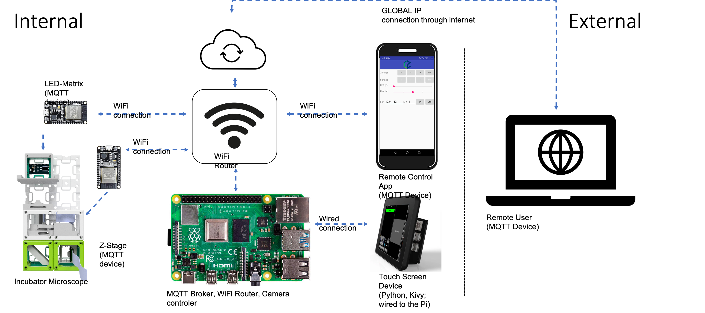
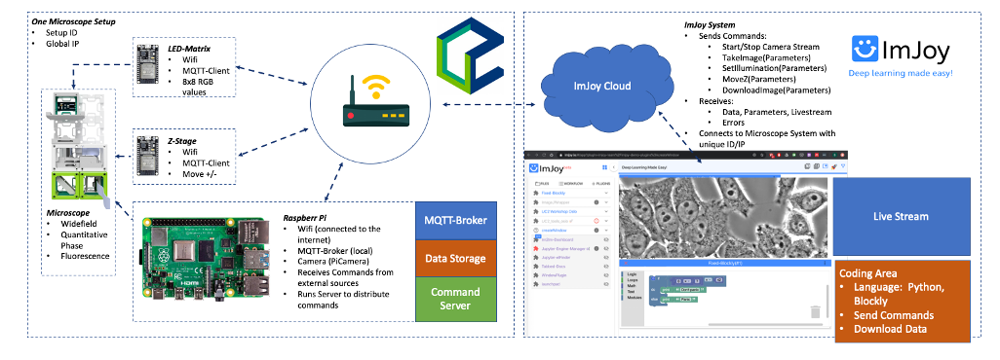

# UC2 goes Cloud ☁️ 

**2nd Photonics Days Makathon:** *Digital concept for university internships in physics and optics*

Cool that you made it that far! Happy to have you on board! :-) 

## 📅 General Schedule

| Date | Time | Task |
| ------------- |:-------------:| -----:|
|  21.09. | 09.30 – 22.00 | Makeathon |
|  22.09. | 09.30 – 11.30  | Pitches |


## What is UC2?

UC2 [You-See-Too] is a joint research project of the Leibniz Institute for Photonic Technology (IPHT) Jena and the Lichtwerkstatt Jena. The aim is to abstract the function of each complex optical device and to guarantee reusability by dividing it into functional subgroups. The assembly of these modules to an optical setup, e.g. a light microscope, is done intuitively without much previous knowledge according to the modular principle. The system is based on commercially available components such as the Raspberry Pi (+camera), smartphones, low-cost optics and innovative 3D- printed cubes, which are mounted on a magnetic base plate. Each cube can contain a specific function. By combining different functions, complex systems are created, which can range from a simple lens to a sensitive holographic microscope. The product therefore does not end at the moment of its production, but lives on through the creativity of the user. 

One 3D printed cube is mounted on a magnetic baseplate:
<p align="center">

</p>

You can customize a cube with inserts and combine them to very complicated optical setups:
<p align="center">

</p>


## UC2 Principle 

- The "4f'-Optics" concept allows lenses to be linked like functional blocks
- A simple microscope is created by snapping two lenses together at a certain distance from each other 
- The 3D-printed UC2 system enables a stable mounting by means of a magnetic mechanism
- Adding additional components (such as lasers) can lead to complex setups like the light-sheet microscope (figure).
- The frame (cube, base plate) forms the skeleton of the toolbox
- The mechanical insert is developed by the user and determines the function of the cube 


The "4f'-optics" or Fourier optical principle basically means, that focal lengths of ajacent lenses follow one another and form image and Fourier planes:

</p>


## Problem

Presence events at many universities are currently "corona-conditioned", although university operations must continue. For many students, this means that in addition to the classic lectures and seminars, internships and final theses are also part of the successful completion of their studies. Experiments via videos help to understand, but the experiences actually only follow from the interaction. The same applies to biologists* who now have clearly limited access to the laboratory. Experiments that require microscopes are thus made much more difficult. 


## General UC2 Structure

- 📝 [UC2 - Paper/Preprint](https://www.biorxiv.org/content/10.1101/2020.03.02.973073v1) 

- 👨‍💻 [UC2 - Software Repository](https://github.com/bionanoimaging/UC2-Software-GIT/)

-  🧰 [UC2 - Hardware Repository](https://github.com/bionanoimaging/UC2-GIT/)

- 📃 [UC2 - Website ](https://youseetoo.org)


## Challenge

With UC2 we want to provide the missing access to both optical experiments and microscopes from remote. In doing so, we are aiming for the "lab-in-the-cloud", where components such as cameras, stages or lamps can be operated by external devices (e.g. laptops). A minicomputer (Raspberry Pi) enables digital image acquisition, additional components such as the Arduino microcontroller or ESP32 ensure the control of motors for focusing and lighting. 

The challenge is to create a web interface in the sense of "IoT" (Internet-of-things), where students can log in and program, control and monitor the devices from home. Common protocols such as MQTT and Web-RTC for controlling and reading the images are to be tested. The finished microscope will be located at the Leibniz IPHT during the "Challenge" and can be remotely programmed via SSH.

**🔬 How it could look like:**

<p align="center">

</p>

*Fig. 1: The graph shows the general structure of the MQTT-based communication architecture of the UC2 blocks. Components such as LED-Matrix and Z-stage are connected to ESP32 microcontrollers which connect to the MQTT broker (Mosquitto) running on a Raspberry Pi through a WiFi router*


ℹ️  More information for the incubator microscope can be found [**here**](https://github.com/bionanoimaging/UC2-GIT/tree/master/APPLICATIONS/APP_Incubator_Microscope). Information 


## Solution 

Since the devices from the UC2 project already have a network and IoT capable interface, only one connection between the devices and the users at home is needed. In the best case this should be done via a browser platform where students can log in and work on the tasks remotely. 
The goal is to create a website that displays the video stream from a Raspberry Pi camera and provides buttons for hardware functions such as light on/off. The commands for the hardware are to be sent from the Raspberry Pi to the MQTT devices located on the same network.


## Milestones 

The task mentioned above sounds like a lot of work. Where to start? In the following we try to break down the final goal to access the small microscope to external users through a website into little pieces.

### ℹ️ Some general information in advance

***📤 Datalimit:*** The microscope is connected to a portable Wifi hotspot which has a datalimit of **10GB** for the **10h** makathon!

***✉️ Contact:*** You can reach us by filling an issue in this github repository, via the Discord channel or via mail: **[info@youseetoo.org](info@youseetoo.org)**.

***⛏ Software:***

- SSH: Access the Raspberry Pi remotely through [WinSCP](https://winscp.net/eng/docs/lang:de) + [Putty](https://www.putty.org/)
- ImJoy: Create a plugin which connects Python, Javascript and streaming applications using [ImJoy](https://imjoy.io/) for tutorials look [here](https://imjoy.readthedocs.io/en/latest/tutorials/)
- Chrome: Debugging HTML/Javascript becomes handy with chromes on-board debugging tools 
- MQTT.fx: An open-source MQTT client to send and receive MQTT commands [https://mqttfx.jensd.de/](https://mqttfx.jensd.de/)

***📷 LiveStream of the setup:***

We have created a Zoom webstream of the setup. The Link is  accessible through the ***Discord*** channel

***🔐 User credentials:***
 
```
*Raspberry Pi*
user: pi
password: raspberry

*VPN*
user: XXX
password: XXX
```

***Helpful Links***

- MQTT: The different devices communicate through the internet-of-things based communication protocol [MQTT](https://en.wikipedia.org/wiki/MQTT)
-  A nice tutorial summarizing the working principle for the ESP32 and Raspberry Pi can be found [here](https://www.instructables.com/id/How-to-Use-MQTT-With-the-Raspberry-Pi-and-ESP8266/)
- Stream video (at lowest quality possible), more information [here](https://appuals.com/how-to-perform-video-streaming-using-raspberry-pi/)
- MJPEG and HTTPS vs h264 with webRTCTest, more information [here](https://medium.com/home-wireless/headless-streaming-video-with-the-raspberry-pi-zero-w-and-raspberry-pi-camera-38bef1968e1)
- SSH-Cheatsheet .. [for example](https://www.thomas-krenn.com/de/tkmag/wp-content/uploads/2017/05/ssh-cheat-sheet-v1.0.pdf)


## Steps

The final goal is to exploit the microscope to a web-based GUI (ImJoy), where basic functionalities such as light on/off, motor up/down, video stream start/stop can be controlled. The next steps should help you to reach this goal! 

### What is ImJoy?

[ImJoy.io](https://imjoy.io) is an open-source web-based image processing tools with a very nice GUI. It is plugin-based an can easily bridge Javascript, Python and HTML. 


</p>

Take a moment and exploit the plugins [here](https://imjoy.io/repo/) and select the "Image Recognition" plugin (scroll down) and hit the little cloud to "install" it. IT will be added to your ImJoy instance running in your browser. Click on the image recognition plugin in the taskbar on the left. It loads a tensorflow.js neural network model to classify an image. Hit predict and it will tell you, that it's a cat! Surprise..

You can directly access the plugin through this [link](https://imjoy.io/lite?plugin=imjoy-team/imjoy-plugins:Image%20Recognition) and install it through this [link](https://imjoy.io/#/app?plugin=imjoy-team%2Fimjoy-plugins%3AImage%20Recognition) 

The goal is: Embedd a simple GUI in a ImJoy plugin. The next few steps will guide you there..


### 0. Connect to the Raspi 

The Raspberry Pi located at the Leibniz IPHT Jena is connected to a Wifi Router which itself is connected to the internet through a UMTS USB Stick. 
The global IP address is XX.XX.XX.XX.

General steps to connect to the Raspi: 

0. Establish VPN connection

1. Use you default SSH client and use the public IP-address; Type ```ssh pi@XX.XX.XX.XX```


VPN + SSH + HTTPS
Setup VPN-connection (openvpn client) + login via SSH
Read & understand python script/call structure with MQTT via <GITLINK>

### 1. Control Motors remotely 

As visualized in Fig 1., the general communcation works as follows:

**MQTT Broker:** The Raspberry Pi hosts a mosquitto MQTT Broker which acts as a relay server 

**ESP32 Microcontroller:** We connected several *Espressife ESP32 microcontrollers* to the Wifi network each bridges external electronic components such as LED matrices to the IoT. An example script can be found in our [Software Github Repo](https://github.com/bionanoimaging/UC2-Software-GIT/tree/master/HARDWARE_CONTROL/ESP32) and an ESP example code [here](https://github.com/bionanoimaging/UC2-Software-GIT/blob/master/HARDWARE_CONTROL/ESP32/GENERAL/ESP32_ledarr/src/ESP32_ledarr/ESP32_ledarr.ino)

**MQTT Client:** You can send MQTT commands to the ESP32s in order to turn on/off the light using the client *MQTT.fx* mentioned above. In order to do so

**PiCamera:** The raspberry Pi features a camera connected to the microscope which can be controlled either through the command line interface using the commands ```raspistill``` or a more sophisticated way is the python library ```picamera```. Entering ```raspistill -f -t 1000``` produces a 1s long stream but is not visible through the ssh connection. Anyway, you can save the image by typing ```raspistill -f test.jpg -t 1000``` in the folder you're current in


#### TASKs

With the help of the prepared MQTT scripts do the following 

- Turn on/off light 
- Move the motor left/right
- take an image through the command line interface and transfer it to your local machine through SSH 


- motors, LED

## 2. Create simple web-based GUI 

This task should help you to create a Vue.JS-based plugin, which offers a button to set the LED on and off again. 

- Button for LED on/off
- Start/Stop Video STreaming and display it (at lowest quality possible), have a look [here](https://appuals.com/how-to-perform-video-streaming-using-raspberry-pi/)
- Test MJPEG and HTTPS vs h264 with webRTCTest, more information [here](https://medium.com/home-wireless/headless-streaming-video-with-the-raspberry-pi-zero-w-and-raspberry-pi-camera-38bef1968e1)
- Create a homepage and run on RASPI -> VUE.js which calls a node.js interface and redirects commands

## 3. Create WebRTC camera live-stream using Janus

*Wikipedia:*
WebRTC Gateway connects between WebRTC and an established VoIP technology such as SIP. WebRTC (Web Real-Time Communication) is an API definition drafted by the World Wide Web Consortium (W3C) that supports browser-to-browser applications for voice calling, video chat, and messaging without the need of either internal or external plugins.

It relies on a WebRTC connection which basically looks like this:

<p align="center">

</p>

The STUN/TURN server in between exchanges public IP addresses between the sender/receiver to directly stream larger data packages from host to host.

We want to use this framework to exploit the camera stream to the outside world (your screen at home). 

Some references for the WebRTC protocol

- [https://www.linux-projects.org/uv4l/installation/](https://www.linux-projects.org/uv4l/installation/)
- [https://www.linux-projects.org/uv4l/tutorials/custom-webapp-with-face-detection/](https://www.linux-projects.org/uv4l/tutorials/custom-webapp-with-face-detection/)
- Get a free DynDNS [https://telebit.cloud/](https://telebit.cloud/)


#### Quick Guide to Install JANUS GATWAY:

The tutorial is derived from this [guide](https://planb.nicecupoftea.org/2015/10/17/hackspace-hat-quick-install-or-audio-and-video-streaming-from-a-raspberry-pi-to-a-remote-or-local-webrtc-compatible-browser/)

**Prepare the PI**
```
sudo apt-get update -y && sudo apt-get upgrade -y
sudo apt-get install -y libgstreamer0.10-0-dbg libgstreamer0.10-0  libgstreamer0.10-dev 
sudo apt-get install aptitude
sudo aptitude install libmicrohttpd-dev libjansson-dev libnice-dev libssl-dev libsrtp-dev libsofia-sip-ua-dev libglib2.0-dev libopus-dev libogg-dev libini-config-dev libcollection-dev pkg-config gengetopt libtool automake dh-autoreconf nginx

sudo apt-get install libmicrohttpd-dev libjansson-dev libnice-dev libssl-dev libsrtp-dev libsofia-sip-ua-dev libglib2.0-dev libopus-dev libogg-dev libini-config-dev libcollection-dev pkg-config gengetopt libtool automake dh-autoreconf  libconfig-dev libsrtp2-dev
```

**Install JANUS GATEWAY**
```
cd ~/Downloads
git clone https://github.com/meetecho/janus-gateway.git
cd janus-gateway
sh autogen.sh
```

**Configure Janus Build settings**
```
#./configure --disable-websockets --disable-data-channels --disable-rabbitmq --disable-docs --prefix=/opt/janus
#./configure --prefix=/opt/janus --disable-websockets --disable-data-channels --disable-rabbitmq --disable-docs
./configure --disable-websockets --disable-data-channels --disable-rabbitmq --disable-docs --prefix=/opt/janus --disable-aes-gcm # some modification to make it work..
```

**Build and install Janus**
```
make
sudo make install
sudo make configs
```

**Configure Janus Streaming settings**
open the file
```
sudo nano /opt/janus/etc/janus/janus.plugin.streaming.cfg
```

and add this to the bottom (probably some adjustmens need to be done..

```
[gst-rpwc]
type = rtp
id = 1
description = RPWC H264 test streaming
audio = yes
audioport = 8005
audiopt = 10
audiortpmap = opus/48000/2
video = yes
videoport = 8004
videopt = 96
videortpmap = H264/90000
videofmtp = profile-level-id=42e028\;packetization-mode=1
```

Depending on the config type this (i.e. jcfg vs cfg) you need to use this:

```
sudo nano /opt/janus/etc/janus/janus.plugin.streaming.jcfg
```

then add:

```
gst-rpwc: {
        type = "rtp"
        id = 1
        description = "RPWC H264 test streaming"
        metadata = "You can use this metadata section to put any info you want!"
        audio = false
        video = true
        audioport = 8005
        audiopt = 10
        audiortpmap = "opus/48000/2"
        videoport = 8004
        videopt = 96
        videortpmap = „H264/90000"
	  videofmtp = profile-level-id=42e028\;packetization-mode=1
}
```

**Add the janus webpage to your Webserver to make it publicly available**

```
sudo cp -r /opt/janus/share/janus/demos/ /var/www/html
```

Open an additional Terminal console and start the stream of the raspicamera
```
raspivid --verbose --nopreview -hf -vf --width 640 --height 480 --framerate 15 --bitrate 1000000 --profile baseline --timeout 0 -o - | gst-launch-1.0 -v fdsrc ! h264parse ! rtph264pay config-interval=1 pt=96 ! udpsink host=127.0.0.1 port=8004
```

or 

```
raspivid --verbose --nopreview -hf -vf --width 640 --height 480 --framerate 15 --bitrate 1000000 --profile baseline --timeout 0 -o - | gst-launch-0.10 -v fdsrc ! h264parse ! rtph264pay config-interval=1 pt=96 ! udpsink host=127.0.0.1 port=8004 alsasrc device=plughw:Set ! audioconvert ! audioresample ! opusenc ! rtpopuspay ! udpsink host=127.0.0.1 port=8005
```


## Final: Implement everything into ImJoy 

- Start reading [imjoy.io-documentation](https://imjoy.io/docs/#/tutorials)
- Setup webRTC on RasPi


</p>


Example ImJoy Plugin which displays the WebRTC stream of the Raspberry Pi.

You can access it inside the ImJoy Framework using this link:
[https://gist.github.com/beniroquai/e1cb9e22d5b5974043154e6b18c83f86](https://gist.github.com/beniroquai/e1cb9e22d5b5974043154e6b18c83f86)

#### -> Steps

1. Go to [imjoy.io](https://imjoy.io)
2. Hit "start imjoy"
3. Click "+ Plugins" on the left handside
4. Past above url ```https://gist.github.com/beniroquai/e1cb9e22d5b5974043154e6b18c83f86```into the "Install from URL" field
5. Hit enter
6. Hit the cloud "Install"
7. On the left handside click the plugin UC2-Streamer - it will give an error... ```UC2-Streamer>Error: failed to import required scripts: https://horrible-fly-95.telebit.io/libs/request.min.js,https://horrible-fly-95.telebit.io/libs/adapter.min.js,https://horrible-fly-95.telebit.io/webrtcstreamer.js....``` since no stream is running..
8. Fix it :) 

#### Boilerplate:

```
<docs lang="markdown">
[TODO: write documentation for this plugin.]
</docs>

<config lang="json">
{
  "name": "UC2-Streamer",
  "type": "window",
  "tags": [],
  "ui": "",
  "version": "0.1.1",
  "cover": "",
  "description": "[TODO: describe this plugin with one sentence.]",
  "icon": "extension",
  "inputs": null,
  "outputs": null,
  "api_version": "0.1.8",
  "env": "",
  "permissions": [],
  "requirements": [
    "https://horrible-fly-95.telebit.io/libs/request.min.js",
     "https://horrible-fly-95.telebit.io/libs/adapter.min.js",
    "https://horrible-fly-95.telebit.io/webrtcstreamer.js"],
  "dependencies": [],
  "defaults": {"w": 20, "h": 10, "fullscreen": true}
}
</config>

<script lang="javascript">

class ImJoyPlugin {
  async setup() {
    api.log('initialized')
  }

  async run(ctx) {
    var webrtcConfig = {
      url: "https://horrible-fly-95.telebit.io" ,
      options: "rtptransport=tcp&timeout=60",
      layoutextraoptions: "&width=320&height=0",
      defaultvideostream: "Bunny"
    }

    var url = { video:"mmal service 16.1" };  
    var options = webrtcConfig.options;
    if (typeof URLSearchParams != 'undefined') {
      var params = new URLSearchParams(location.search);
      if (params.has("video") || params.has("audio")) {
        url = { video:params.get("video"), audio:params.get("audio") };
      }
      if (params.has("options")) {
        options = params.get("options");
      }
    }
    const webRtcServer = new WebRtcStreamer("video", webrtcConfig.url);
    document.getElementById("title").innerHTML=url.video; 
    webRtcServer.connect(url.video,url.audio,options);
    request("GET" , webrtcConfig.url + "/api/version").done( function (response) { 
      document.getElementById("footer").innerHTML = "<p><a href='https://github.com/mpromonet/webrtc-streamer'>WebRTC-Streamer</a> " + JSON.parse(response.body).split(" ")[0] + "</p>";			
    });			

  }
}

api.export(new ImJoyPlugin())
</script>

<window lang="html">
  <div>
    <h2 id="title"></h2>
    <video id="video" muted></video>
    <footer id="footer"></footer>
  </div>
</window>

<style lang="css">
#video {
  width: 100%;
}
</style>
```